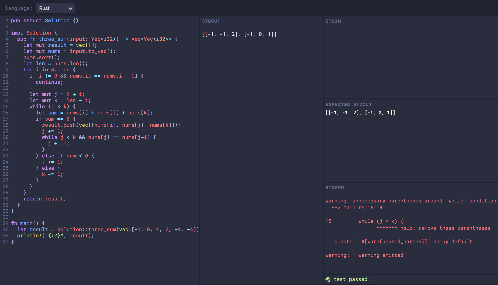

An online code playground with stdin/stdout/stderr support.



Required Docker for code execution. So make sure you already installed it.

To run locally:

```
$ node index.js
```

This application is published under BSD-3-Clause license.
